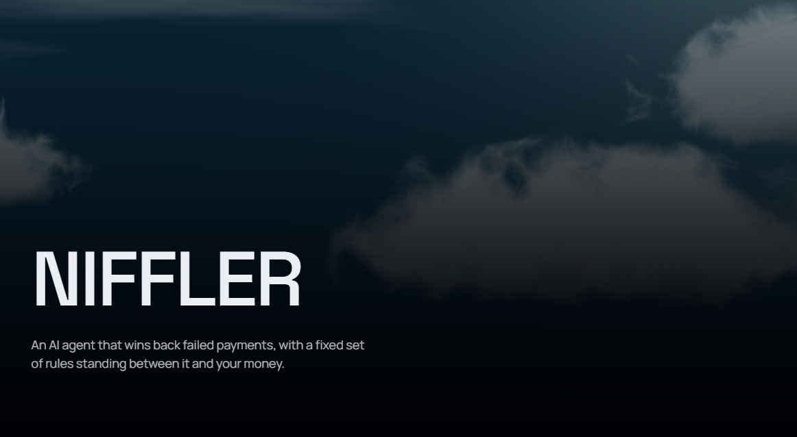
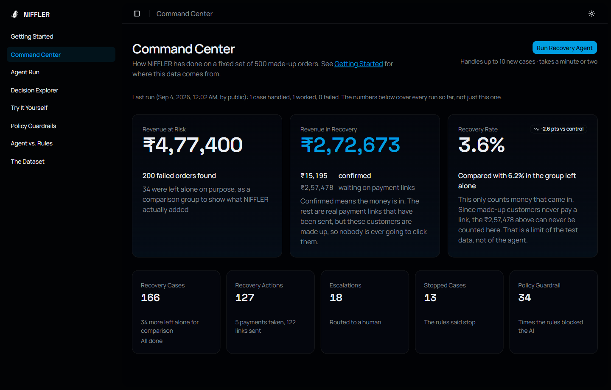
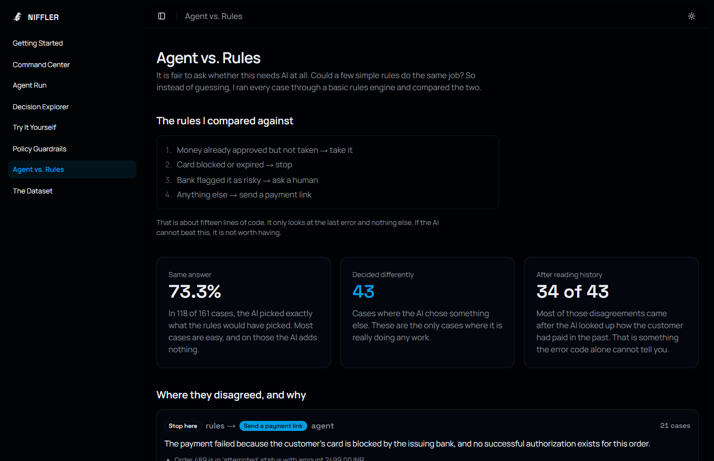

# NIFFLER

An AI agent that wins back failed payments, with a fixed set of rules standing between it and your money.

**30 seconds, one real case.** The agent investigates, decides, and the rules block it anyway.

https://github.com/user-attachments/assets/b55d4729-359d-472f-bb44-e650cb27a575

**[See it live →](https://niffler-web.vercel.app)**

An independent project inspired by Razorpay's AI Revenue Recovery Buildathon track. It runs on Razorpay Test Mode, so no real money moves anywhere in it.

---

## The problem

When a customer tries to pay a shop and the payment fails, the shop usually just loses that sale. But the money is not always gone. The customer wanted to buy something. Something got in the way.

Sometimes the thing in the way is small. The bank timed out. The customer walked off before typing the OTP. Their card expired but they have three other cards. In cases like these, a second chance often works.

Sometimes it is not small at all. The bank flagged the payment as risky. The card is blocked. The customer already paid five minutes later on their own and nobody noticed.

So the real question is not "which payments failed?" It is:

> Which of these failures are worth chasing, what should I do about each one, and did it actually work?

Answering that for one payment is easy. Answering it for a few hundred, correctly, without accidentally charging someone twice, is not.

## The solution

NIFFLER reads each failed payment, works out why it failed, and picks one of four things to do: take a payment that was already approved, send a payment link, hand it to a person, or stop.

The important part is what happens next. **The AI does not get to act on its own.** Whatever it decides goes to a small set of plain rules first, and those rules can say no. They are ordinary code. They give the same answer every time and the AI cannot talk them round.

That split is the whole design. The AI is good at reading a messy situation and explaining it. It is not something you want quietly moving money.

Here is what that produces over 200 failed orders — the results, what to do next, and an honest answer on scale.



## How NIFFLER works

```
Detect → Investigate → Diagnose → Decide → Policy check → Act → Observe
```

1. **Detect** — plain code finds the unpaid orders. No AI yet.
2. **Investigate** — the agent reads the order, the past attempts, and the customer's history. It chooses which of these to look at.
3. **Diagnose** — it writes down why the payment failed, what evidence it used, and how sure it is.
4. **Decide** — it picks one action out of four.
5. **Policy check** — four rules examine that choice. The strictest one wins.
6. **Act** — only an approved action reaches Razorpay.
7. **Observe** — the result is recorded, either straight away or later via a webhook.

Every step is written to an audit log, so any case can be replayed afterwards and you can see exactly what it knew and why it chose what it chose.

## Why AI, and why an agent?

This deserves a straight answer rather than a sales pitch, so the app measures it.

I built the rules engine this project could have been — about fifteen lines, `latest error → one action` — and ran every decided case through both.

**They agree 73.3% of the time** (118 of 161 cases). On the easy majority, the AI adds nothing, and claiming otherwise would be easy to disprove.

The other 43 cases are where it earns its place. **34 of those 43 disagreements came after the agent chose to go and read the customer's payment history** — evidence an error code does not contain. For example:

- **21 cases**: the rules give up on a blocked or expired card. The agent noticed the same customer had recently paid fine using UPI, so a payment link was worth sending.
- **10 cases**: the rules wanted to send a payment link. The agent noticed the order had quietly been paid on a later attempt. Sending that link would have charged the customer twice.
- **7 cases**: the rules escalate every bank risk block to a human. The agent checked the customer's record, found nothing suspicious, and treated it as a problem with that one payment method.

It is also an agent rather than a single AI call because it decides what to look at. It can read the order, stop there, and answer. Or it can pull the customer's whole history first. That choice is what produces the 34 cases above.

Every one of those comparisons is on the dashboard, case by case, rather than only summarised here.



## System architecture

```
                    ┌─────────────┐
                    │     LLM     │   Groq, with Gemini as backup
                    │  reasoning  │
                    └──────┬──────┘
                           │  proposes an action
                           ▼
                  ┌──────────────────┐
                  │  POLICY ENGINE   │   plain code, no AI
                  │  4 fixed rules   │
                  └────────┬─────────┘
                           │  allowed / blocked / ask a human
                           ▼
                    ┌─────────────┐
                    │    TOOLS    │   each one validated and logged
                    └──────┬──────┘
                           ▼
                    ┌─────────────┐
                    │  Razorpay   │   real Test Mode API calls
                    └─────────────┘
```

The LLM can only ever *suggest*. It has no path to Razorpay that does not go through the policy engine first. That is enforced by structure, not by asking the model nicely.

Two seams make the whole thing swappable:

- **`PaymentDataSource`** — the payment world behind one interface. One implementation reads the generated dataset, another calls Razorpay. The agent, tools and rules never know which they are talking to.
- **`LlmClient`** — one small interface, one adapter per provider, and a wrapper that switches to the backup on a rate limit.

## Key features

- **A real agent loop**, written by hand rather than pulled from a framework, so the boundary between reasoning and action is a specific piece of code you can point at.
- **A policy engine that can overrule the AI**, with all reasons recorded, not just the deciding one.
- **A state machine** every case must walk. No code, including mine, can skip a step.
- **Real Razorpay Test Mode integration** — orders, captures, Payment Links, and a signature-verified webhook.
- **A control group.** 34 of the 200 failed orders are deliberately never touched, so recovery can be compared against doing nothing. Those same cases are what Agent Run offers, and each rewinds itself once watched — so the case where the rules overrule the agent is there for every visitor, not just the first.
- **A full audit trail.** Every read, decision and action is stored and replayable.
- **Try it yourself.** Create a real test order, fail it on purpose, and watch the agent handle a case it has never seen. If it sends a payment link, that link is real and payable — pay it and a webhook turns the case into a confirmed recovery.
- **An answer on scale**, on the dashboard rather than buried here: what was measured, where the bottleneck actually is, and what is missing.

The full loop against a real Razorpay order — created, failed on purpose, investigated, and answered with a link you can actually pay:

https://github.com/user-attachments/assets/4d125efc-09cb-487d-8abd-286a5e39b63b

## Example investigation

This is a real case. Everything below is what it actually produces, and you can watch it happen on the Agent Run page.

**Order `order_00IRw2eTETjjwJ`, ₹2,499, marked unpaid when the batch started.**

```
getOrder              → status: "paid"
listPreviousAttempts  → 2 payments:
                          pay_eRg8wdgcIZYNCz  failed   (netbanking, gateway timeout)
                          pay_A9BoSD94dubM31  captured (UPI, 29 May)
```

The agent's diagnosis, at 96% confidence:

> The order for case 576 has been successfully paid; the initial netbanking attempt failed but a later UPI payment was captured.

Evidence it cited:
- Order status: paid (`order_00IRw2eTETjjwJ`, amount ₹2,499)
- First payment attempt failed due to gateway timeout
- Second payment attempt captured successfully on 2026-05-29

It recommended **STOP**. Then the rules ran anyway:

```
policyCheck → DENIED
  · Order is already paid; no recovery action applies.
  · 1 failed attempt so far, under the limit of 3; another attempt is allowed.
  · No recovery link has been sent for this case yet.
```

Two things worth noticing. The order was unpaid when it was picked up and paid by the time the agent looked, because the agent re-reads before acting instead of trusting the list it started from. And the rules returned DENIED independently — they were not agreeing with the AI, they simply reached the same place. If the AI had asked to send a payment link here, it would have been blocked just the same.

## Tech stack

| | |
|---|---|
| Language | TypeScript, end to end |
| Frontend | Next.js, Tailwind, shadcn/ui |
| API | Express |
| Database | PostgreSQL with Drizzle |
| Validation | Zod, at every boundary |
| AI | Groq, with Gemini as a fallback |
| Payments | Razorpay Test Mode |
| Hosting | Vercel, Render, Neon |

No agent framework. The loop is my own code, and writing it is what made me understand it.

## Engineering decisions

**No LangChain or LangGraph.** The interesting part of this project is the line between what the AI suggests and what actually runs. A framework's built-in executor calls tools from inside its own loop, which blurs exactly the line worth showing. It is also a much bigger tool than this problem needs: one agent, one case at a time, four possible actions.

**The payment data is generated, the actions are real.** A Razorpay test account starts empty, payments cannot be failed on demand from the server, and test payments cannot be backdated. There is no way to build a year of realistic history inside one. So the history is generated from a fixed seed, and every action taken on it is a real API call.

**Ground truth is unreachable, not just unused.** Each generated order carries a hidden label saying what it was built to represent. That label lives behind a separate interface that only the scoring code holds, so it cannot leak into a prompt even by mistake.

**Money is an integer count of paise.** Never a float. Rounding cannot lose a rupee.

**Order, Payment and Failure mirror Razorpay's own shapes**, so the same code runs against generated data and a live account with nothing in between to translate.

**A negative result is left on the dashboard.** Confirmed recovery is 3.6% against 6.2% in the untouched control group. That looks bad until you see why: a made-up customer can never click a payment link, so ₹2,57,478 of sent links can never turn into a confirmed recovery. It is a limit of the test data, and hiding it would have been easy and dishonest.

## Monorepo structure

```
apps/
  api/src/            Express API and the Razorpay webhook receiver
  web/
    app/dashboard/    the eight dashboard pages
    components/       React components
    lib/              API client and shared helpers

packages/core/
  src/
    domain/           types, schemas, the state machine, the four policy rules
    generator/        the seeded dataset builder
    data/             PaymentDataSource — JSON and Razorpay implementations
    detection/        finds the orders worth chasing
    cases/            creating cases and moving them between states
    agent/            the loop, the LLM adapters, the closed loop
    tools/            the seven tools, each validated and logged
    evaluation/       batch runs, metrics, control group, rules comparison
    webhooks/         signature checking and the paid-link handler
    db/               Drizzle schema and client
  scripts/            32 runnable scripts (see below)
  data/world.json     the generated dataset, committed so it never drifts
  drizzle/            SQL migrations
```

`src/domain/` imports nothing from outside itself. It is types and pure functions, which is what makes the rules testable and keeps them honest.

### The scripts

`packages/core/scripts/` is where most of this project was actually built and checked. 22 of the 32 are `check-*` scripts, one per module, and each one runs the real thing against real data rather than mocks:

```bash
npm run check:policy      --workspace @niffler/core   # the four rules, on real orders
npm run check:tools       --workspace @niffler/core   # every tool, including idempotency
npm run check:investigate --workspace @niffler/core   # one real LLM investigation
npm run check:recover     --workspace @niffler/core   # the closed loop, end to end
npm run check:holdout     --workspace @niffler/core   # the control group split
npm run check:razorpay    --workspace @niffler/core   # a live Test Mode API call
```

The rest do the work: `npm run reset` clears and re-detects, `npm run batch` processes a batch, `npm run report` prints the metrics, and a handful seed or repair live Razorpay cases. `generate-world.ts` rebuilds the dataset from its seed, though you never need to — the result is committed, and the same seed always produces the same file.

These are how I verified each stage before moving to the next, and several real bugs in this repo were found by running them rather than by reading the code. They are also the honest weak spot: they assert properly, but they are run by hand, not by CI.

## Reliability and guardrails

Four rules stand between the agent and any action:

| Rule | Question | If it trips |
|---|---|---|
| Eligibility | Is this order still unpaid? | Blocked |
| Attempt limit | Has this already failed too many times? | Ask a human |
| Prior recovery link | Has a link already gone out? | Blocked, or ask a human |
| Iteration limit | Is the agent going round in circles? | Ask a human |

Beyond those:

- **Duplicate webhooks are ignored.** Razorpay resends a message if it does not hear back. Every delivery is checked against the case's audit trail first, so a payment cannot be counted twice.
- **Webhook signatures are verified** against the raw request body before it is parsed, and compared in constant time.
- **The state machine is never skipped.** Even internal code walks it one legal step at a time.
- **A failing tool is information, not a crash.** The error goes back to the model, which can try something else.
- **If one AI provider rate-limits, the other takes over**, including part-way through a case. If both are out of quota, the page says so rather than showing an empty diagnosis that looks like a broken agent.
- **If the database is unreachable, pages say so** instead of collapsing.
- **Case creation is idempotent**, so running detection twice cannot duplicate work.

## Getting started

You need Node 22+, Docker, and free API keys from Groq and Razorpay Test Mode.

```bash
git clone https://github.com/ankitku3101/niffler.git
cd niffler
npm install

docker compose up -d                                # Postgres on port 5433
cp packages/core/.env.example packages/core/.env    # then fill it in

cd packages/core
npx drizzle-kit migrate                             # create the tables
npm run reset                                       # find the failed orders
cd ../..

npm run dev                                         # web on 3000, api on 4000
```

The generated dataset is committed, so there is nothing to build. `npm run reset` reads it, finds the 200 unpaid orders and creates a case for each.

To watch the agent work through a single case in your terminal:

```bash
npm run check:recover --workspace @niffler/core
```

To run a batch and see the numbers:

```bash
npm run batch --workspace @niffler/core -- groq 10
npm run report --workspace @niffler/core
```

## Environment variables

All of these live in `packages/core/.env`.

| Variable | Needed | What it is |
|---|---|---|
| `DATABASE_URL` | yes | Postgres connection string |
| `GROQ_API_KEY` | yes | Free tier is enough |
| `GEMINI_API_KEY` | yes | The fallback provider |
| `RAZORPAY_KEY_ID` | yes | Test Mode key |
| `RAZORPAY_KEY_SECRET` | yes | Test Mode secret |
| `RAZORPAY_WEBHOOK_SECRET` | yes | The server refuses to start without it |
| `OWNER_BYPASS_TOKEN` | no | Skips the public run cooldown, for demos |
| `WEB_ORIGIN` | no | Locks CORS to your frontend in production |
| `GROQ_MODEL` | no | Defaults to `openai/gpt-oss-120b` |
| `GEMINI_MODEL` | no | Defaults to `gemini-3.5-flash` |

The frontend only needs `NEXT_PUBLIC_API_URL`.

## Future improvements

- **Automated tests.** There are verification scripts with real assertions for every module, but they are run by hand. They belong in a test runner with CI behind them, and that is the biggest gap in this repo.
- **Rate limiting.** Creating a test order is unmetered. Test Mode limits the damage, but it should still be capped.
- **A smarter customer-level limit.** The attempt limit counts failures per order. It should probably also look across everything one customer has tried recently.
- **Recovery links go nowhere in the generated data.** A confirmed recovery only happens through a real payment. Simulating a customer paying a link would make the headline number mean more.
- **Sticky provider fallback.** The switch to the backup AI happens per call rather than per investigation. Either provider can now pick up a conversation the other started, so nothing breaks, but a case that has already switched still pays for a failed call to the exhausted provider every turn.

---

Built by [Ankit Kumar](https://github.com/ankitku3101). Independent project, inspired by Razorpay's AI Revenue Recovery Buildathon track, built on Razorpay Test Mode.
